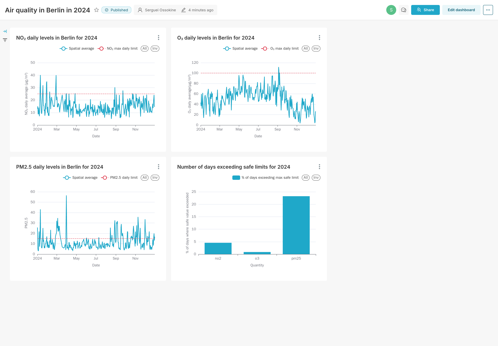

# Introduction
Now that we know how to associate a sensor with its human-readable geographical location, we can collect data for all the sensor ids that correspond to our desired location, which in our case is Berlin.

## Detailed discussion of the steps
This is accomplished by the [`airquality-analysis`](https://github.com/SergeiOssokine/airquality_capstone/blob/main/flows/dbt_location_analysis.py) flow, pictured below:

For every sensor id, we download the sensor's measurement data from S3 for the latest complete year (2024). We do this via S3 instead of via OpenAQ API as this avoids rate-limiting, and the data can be batch-downloaded. This data includes, for every sensor, the readings of ${\rm NO}_2$, $\rm{O}_3$, and other pollutants on an hourly cadence, so we can expect to collect as many as (`number_of_sensors`) * 24 * 365 rows.

The OpenAQ S3 archive returns compressed csv data, one csv file for every single day for every single sensor. This is a lot of files, so in the interest of not having so many uploads, we therefore create from these files one combined dataframe with all the data aggregated in it. We write this dataframe to a single compressed parquet file and this is then uploaded to our datalake (GCS). Since there is no geospatial information here, we do not need clustering and so we copy this table into the data warehouse for access in BigQuery, ensuring correct timestamp format.

At this point we have only the raw data in our data warehouse (BQ) for sensor measurements. We once again use `dbt` to transform it to a final data product ([`core_sensors_data.sql`](https://github.com/SergeiOssokine/airquality_capstone/blob/main/dbt/airquality/models/core/core_sensors_data.sql)). We use `dbt` to compute the spatial average (across all sensor ids) for each pollutant. This is one value per hour, per pollutant, for all of Berlin. We then add this to the data read in from every individual sensor, so that we could better identify outlier sensors as needed.

## Further Analysis (Dashboards)

At this point our data products are ready for an analyst to make some useful conclusions. One of the things we might like to know is how bad the air quality is, by comparing the values of the pollutants in Berlin to the WHO-recommended maximum values. Do we exceed the recommended threshold? On what days?

We select the spatial average in the dashboard to show the average ${\rm NO}_2$, $\rm{O}_3$, and ${\rm PM}2.5$ averaged over a day (24 hourly readings) and present this against the WHO threshold.

Some days are clearly above, but many days are clearly below. ${\rm NO}_2$, for example, is low during the summer periods, when many people are away on holiday and not driving their cars. We can also notice the overall increase in ozone $\rm{O}_3$ levels during the summer months which is due to the increased temperature and the correspondingly higher rate of photochemical reactions that produce ozone.

We also count the number of days in a year where the levels of the pollutants exceeded the WHO recommended 24-hr exposure levels. The ${\rm PM}2.5$ levels are most striking here, and we see that nearly a quarter of 2024's days exceeded the WHO-recommended safe limit in Berlin. Overall, elevated levels of this type of particulate matter [has been linked](https://ww2.arb.ca.gov/resources/inhalable-particulate-matter-and-health) to adverse health effects such as cardiovascular disease.

Preset allows the export of entire dashboards as `yaml` configuration. The code to reproduce the dashboard can be found [here](https://github.com/SergeiOssokine/airquality_capstone/tree/main/dashboard-export).