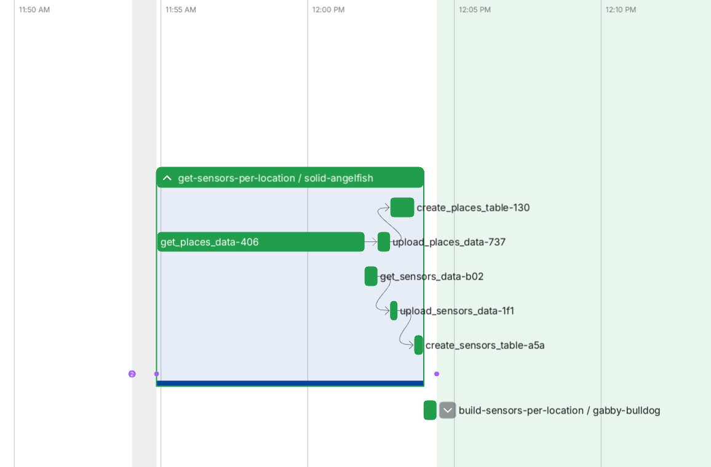

# Introduction

## OpenAQ data

OpenAQ provides data about the location and state of many sensors around the globe, including the GPS coordinates, as well as an amount of other auxiliary information.However, OpenAQ doesn't provide a recognisable geographical location for these sensors. E.g., their dataset download would only report the GPS coordinates of a particular sensor, and not that it is in Paris, or New Delhi, or Berlin. We would like to associate a sensor for a city location for this project to be able to filter on a human-readable geographical location, like a particular city. For us, that's Berlin.

To do this, we need bounding box data. We can use Open Street Map Data by GeoApify which keeps an association of the geographical names of places like cities or towns and yields a corresponding bounding box in GPS coordinates. (We use GeoApify as their download method is easy to use and they have packaged the OpenStreetMapo data in a convenient way while keeping the same licence.). **Once we have the bounding boxes we can then check if the GPS coordinates of the sensors fall in given bounding boxes, thus allowing us to associate these GPS coordinates with a geographic location**

## Detailed discussion of the steps

This is accomplished by the [`sensors_per_location`](https://github.com/SergeiOssokine/airquality_capstone/blob/main/flows/sensors_per_location.py) flow, pictured below:

Here are the steps in more detail.

First, we download both datasets from their sources. We select:

1. from OpenAQ, the name of the location, its GPS coordinates, and the sensor IDs for a given location ("sensor data")
2. from GeoApify, the human-readable name of the place (e.g. Berlin) and the GPS-coordinates of its bounding box ("geographical data").

Note that for 1, the name of the location is not the same as a geographical location, but usually more specific, like the name of the university or government institution where the sensors are hosted.

Then, for both sets of data we:

1. convert the GIS information into [shapely](https://shapely.readthedocs.io/en/stable/) geometry,
2. re-save the data in [GeoParquet](https://geoparquet.org/) file format,
3. upload the data to datalake (GCS)

We then build tables from the raw data in our warehouse (BigQuery) corresponding to both sets of data. We cluster the data by geometry to improve performance Clustering by geometry column is the recommended way of improving geospatial operations in BigQuery, so we use it here in anticipation of the next step.

Finally, we use `dbt` (see [`stg_sensors_per_location.sql`](https://github.com/SergeiOssokine/airquality_capstone/blob/main/dbt/airquality/models/staging/stg_sensors_per_location.sql)) to take the clustered dataset of geographical data, and the sensor data, both from the data warehouse.  Naively we could simply do an inner spatial join on the geometry column using the `ST_WITHIN` clause which would check if the given set of GPS coodinates is within given bounding box. However, there is a slight complication because the bounding boxes can and do overlap. To overcome this we do the following:

- compute the area of every bounding box for every geoegraphic location
- perform the spatial join
- assign a rank based on the area to every row, partitioning by location_id and then within each partition pick the location with the _largest_ area.

A successful flow run can be seen below:

This final data product will be used to associate the sensor data location ID (a 4 digit number) with an actual location on the globe, not expressed as GPS coordinates, but rather a human-readable name like "Berlin". This could in principle be extended for any named entity across the globe (other cities, towns, villages, countries).
